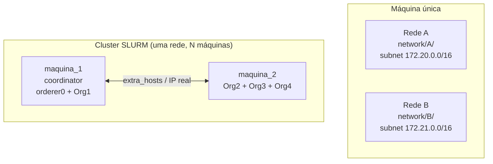

<div align="center" id="topo">


# <code><strong>Hyperledger Fabric Network Automator</strong></code>

*Orquestrador Python que sobe redes Hyperledger Fabric completas — CAs, identidades, canais e chaincodes CCaaS — a partir de uma única definição YAML, com suporte a múltiplas redes coexistindo na mesma máquina e a deploy distribuído multi-máquina via SLURM.*

<!-- Badges -->
[]()
[]()
[]()
[]()

[]()
[]()

[]()
[](https://github.com/RianValcanaia/IC_Create_Network/releases/tag/v1.0)
[]()

[](https://www.linkedin.com/in/rian-carlos-valcanaia-b2b487168/)
</div>

---

# 📑 Índice

- [📌 Sobre](#-sobre)
- [🎯 Objetivos](#-objetivos)
- [🏗 Arquitetura](#-arquitetura)
- [✨ Funcionalidades](#-funcionalidades)
- [📁 Estrutura do Projeto](#-estrutura-do-projeto)
- [🧬 Dependências de Terceiros](#-dependências-de-terceiros)
- [🚀 Instalação](#-instalação)
- [⚙️ Guia de Configuração](#️-guia-de-configuração)
- [▶ Como Executar](#-como-executar)
- [🧪 Exemplos de Uso](#-exemplos-de-uso)
- [📚 Documentação Completa](#-documentação-completa)
- [📄 Código-fonte](#-código-fonte)

---

# 📌 Sobre

Este projeto é um **orquestrador de linha de comando** que, a partir de um único
arquivo `network.yaml`, provisiona uma rede Hyperledger Fabric ponta a ponta: gera
CAs e artefatos Docker Compose, registra e matricula identidades (peers, orderers,
admins), monta o bloco de gênese e as transações de canal, e cuida do ciclo de vida
completo do chaincode no modelo **Chaincode-as-a-Service (CCaaS)**.

- **Qual problema resolve:** montar e derrubar redes Fabric reprodutíveis (locais,
  múltiplas redes na mesma máquina, ou distribuídas por várias máquinas de um
  cluster) sem escrever manualmente `configtx.yaml`, `docker-compose.yaml` ou
  scripts de enrollment a cada mudança de topologia.
- **Tecnologias principais:** Python 3.12+, Hyperledger Fabric 3.1.1, Fabric CA
  1.5.13, Docker/Docker Compose, Go 1.22+ (compilação de chaincode).

Este repositório (`Definitivo/`) é a **versão final consolidada** do projeto,
reunindo as melhorias desenvolvidas em paralelo em branches/experimentos distintos
(suporte a múltiplas redes na mesma máquina, deploy distribuído via SLURM, correções
de robustez). O histórico dessa unificação está documentado em
[`docs/MEMORY.md`](../docs/MEMORY.md), [`docs/WORKLOG.md`](../docs/WORKLOG.md) e
[`docs/NEXT_STEPS.md`](../docs/NEXT_STEPS.md).

[⬆ Voltar ao topo](#topo)

---

# 🎯 Objetivos

- Provisionar uma rede Fabric completa — **CAs → identidades → artefatos de canal →
  peers/orderers → canais → chaincode** — a partir de uma única definição declarativa
  em YAML, sem intervenção manual.
- Suportar os dois modelos de consenso do Fabric: **EtcdRaft (CFT)** e **SmartBFT
  (BFT)**, com validação semântica da topologia antes de qualquer subida.
- Permitir que **múltiplas redes coexistam na mesma máquina**, isoladas por pasta de
  artefatos e IP estático de subnet, sem colisão de containers.
- Permitir que **uma única rede seja distribuída por várias máquinas** (LAN ou
  cluster SLURM), com endereçamento automático por IP real e submissão de jobs
  encadeados por dependência.
- Simplificar o deploy de chaincode via **CCaaS**, eliminando a dependência do
  Docker Socket do peer e facilitando o debug do contrato.
- Oferecer uma **limpeza segura e escopada**: derrubar uma rede específica sem afetar
  outras redes coexistentes, ou fazer limpeza total preservando binários versionados.

[⬆ Voltar ao topo](#topo)

---

# 🏗 Arquitetura

## Pipeline de subida da rede (modo local, `--up`)

```mermaid
flowchart LR
    A["network.yaml"] --> B["ConfigParser<br>valida topologia"]
    B --> C["ComposeGenerator<br>compose-ca.yaml"]
    C --> D["start_cas.sh<br>sobe as CAs"]
    D --> E["CryptoGenerator<br>register_enroll.sh"]
    E --> F["ConfigTxGenerator<br>configtx.yaml + genesis"]
    F --> G["ComposeGenerator<br>compose-nodes.yaml"]
    G --> H["start_nodes.sh<br>sobe peers/orderers"]
    H --> I["ChannelScriptGenerator<br>create_channel.sh"]
    I --> J["ChaincodeDeployGenerator<br>deploy_chaincode.sh (CCaaS)"]
```



## Multi-rede na mesma máquina vs. deploy distribuído multi-máquina

Os dois modos são ortogonais e podem ser combinados:



- **Multi-rede na mesma máquina**: cada rede isola seus artefatos em
  `network/<folder>/` (campo opcional `network.folder`, fallback `network.name`) e,
  se `network.subnet` estiver definida, cada serviço (CA/orderer/peer/chaincode)
  recebe um IP estático determinístico dentro dessa subnet — sem colisão de
  containers ou de rede Docker entre redes coexistentes. Por padrão essa subnet é
  interna ao Docker (as portas continuam publicadas no host); com o bloco opcional
  `network.macvlan` (ver Guia de Configuração §7), os containers passam a usar o
  IP real da subnet diretamente, sem publicar porta — necessário quando duas redes
  coexistentes precisam usar **as mesmas portas numéricas**.
- **Deploy distribuído multi-máquina**: a seção opcional `machines:` (nível raiz do
  YAML) mapeia máquinas para IPs reais da LAN; o campo `machine:` em
  CAs/peers/orderers/chaincodes atribui cada componente a uma máquina. O orquestrador
  gera composes filtrados por máquina e injeta `extra_hosts` para que containers em
  máquinas diferentes se enxerguem. A seção `slurm:` permite gerar um script único
  `#SBATCH` com todas as fases encadeadas (`srun`/`wait`) para submissão em cluster.

## Arquitetura de geradores

| Gerador | Função |
| :--- | :--- |
| `ComposeGenerator` | Gera `compose-ca.yaml`/`compose-nodes.yaml`; aplica IP estático por subnet e filtragem por `machine` no modo distribuído. |
| `CryptoGenerator` | Gera `register_enroll.sh` (fabric-ca-client); em modo distribuído usa IPs reais e IP SANs no certificado TLS. |
| `ConfigTxGenerator` | Traduz a topologia para `configtx.yaml` e gera os perfis de canal (Raft ou BFT). |
| `ChannelScriptGenerator` | Gera `create_channel.sh` — join de orderers via `osnadmin`, join de peers e Anchor Peers dinâmicos. |
| `ChaincodeDeployGenerator` | Gera `deploy_chaincode.sh` (lifecycle CCaaS completo) e `start_chaincodes.sh` (containers CCaaS em modo distribuído). |
| `SlurmDeployGenerator` | Gera o script `#SBATCH` de deploy distribuído completo para submissão em cluster SLURM. |
| `ConfigParser` | Valida semanticamente o `network.yaml` (portas únicas, domínios válidos, seção `machines`, etc). |
| `PathManager` | Resolve os caminhos do projeto, incluindo o namespace `network/<folder>/` por rede. |

[⬆ Voltar ao topo](#topo)

---

# ✨ Funcionalidades

- **Rede local em um comando**: `--up` sobe CAs, identidades, artefatos de canal,
  peers/orderers, canais e chaincode CCaaS a partir de um único YAML.
- **Validação semântica**: erros comuns no `network.yaml` (portas duplicadas, canal de
  bootstrap ausente, referências a organizações/máquinas inexistentes) são
  detectados antes de qualquer container subir.
- **Suporte a EtcdRaft e SmartBFT**: perfis de canal completos para os dois
  protocolos de consenso (BFT requer Fabric v3.x e `n = 3f+1` orderers).
- **Multi-rede na mesma máquina**: `network.folder` + `network.subnet` opcionais
  isolam artefatos e IPs de cada rede, permitindo subir mais de uma rede
  simultaneamente sem colisão.
- **macvlan (opcional)**: `network.macvlan` faz cada container ganhar IP real e
  estático na subnet do host em vez de um IP interno do bridge Docker publicado
  via porta — permite duas redes com **portas numéricas idênticas** coexistirem
  sem qualquer conflito. Ver [Guia de Configuração §7](#7-opcional-macvlan--múltiplas-redes-com-portas-idênticas-ip-real-por-container).
- **Deploy distribuído multi-máquina**: `machines`/`machine` + `--up --machine`,
  `--start`, `--setup` e `--slurm-deploy` espalham uma única rede por vários hosts,
  com endereçamento automático por IP real.
- **Chaincode-as-a-Service (CCaaS)**: o contrato roda em container próprio,
  eliminando a dependência do Docker Socket do peer e simplificando o debug.
- **Gestão de canais**: múltiplos canais com diferentes organizações participantes,
  atualização automática de Anchor Peers.
- **Limpeza segura e escopada**: `--clean net` derruba só a rede alvo (preserva
  outras coexistentes); `--clean all` faz limpeza total (containers, volumes
  nomeados, artefatos gerados, binários do Fabric), preservando `builders/`
  (versionado, necessário para o CCaaS funcionar).

[⬆ Voltar ao topo](#topo)

---

# 📁 Estrutura do Projeto

```text
Definitivo/
├── main.py     # Ponto de entrada: --up, --clean, --start, --setup, --slurm-deploy
├── src/
│   ├── path_manager.py        # Resolve caminhos; namespace network/<folder> por rede
│   ├── config_loader.py       # Carrega e mescla network.yaml + versions.yaml
│   ├── network_controller.py  # Executa os scripts .sh injetando variáveis de ambiente
│   ├── parser.py              # ConfigParser — validação semântica da topologia
│   └── generator/
│       ├── compose.py         # Docker Compose de CAs/peers/orderers
│       ├── crypto.py          # register_enroll.sh (fabric-ca-client)
│       ├── configtx.py        # configtx.yaml + blocos de gênese/canal
│       ├── channel.py         # create_channel.sh (osnadmin + peer channel join)
│       ├── deploy.py          # deploy_chaincode.sh + start_chaincodes.sh (CCaaS)
│       └── slurm.py           # Script de deploy distribuído via SLURM
├── project_config/
│   ├── network_BFT.yaml       # Exemplo de topologia com consenso SmartBFT
│   ├── network_RAFT.yaml      # Exemplo de topologia com consenso EtcdRaft
│   ├── versions.yaml          # Versões do Fabric/Fabric-CA/Go
│   └── core.yaml              # Template de configuração do peer
├── chaincode/
│   └── cc_basic_asset/        # Chaincode de exemplo com PDC
├── builders/ccaas/            # Binários do CCaaS builder oficial do Fabric
├── scripts/                   # Scripts .sh estáticos e gerados dinamicamente
│   ├── ledger_cli.sh          # CLI de invoke genérico no ledger (estático)
│   ├── set_env.sh             # Auto-descobre a rede/org e exporta o ambiente do peer
│   ├── clean_all.sh / clean_network.sh / clean_node.sh
│   └── (register_enroll.sh, create_artifacts.sh, create_channel.sh,
│        deploy_chaincode.sh, start_chaincodes.sh — gerados a cada --up)
├── network/    # Runtime por rede: network/<folder>
└── bin/        # Binários do Fabric
```

[⬆ Voltar ao topo](#topo)

---

# 🧬 Dependências de Terceiros

| Componente | Versão |
|---|---|
| Hyperledger Fabric | `3.1.1` |
| Hyperledger Fabric CA | `1.5.13` |
| CCaaS Builder | oficial (`fabric-samples/ccaas-builder`) |
| Go | `1.22+` |

Os binários do Fabric/Fabric-CA são baixados automaticamente por
`scripts/check_reqs.sh` (via `install-fabric.sh` oficial) na pasta `bin/` — não são
versionados. Já os binários do CCaaS builder em `builders/ccaas/bin/` **são
versionados**, pois nada os recria automaticamente.

[⬆ Voltar ao topo](#topo)

---

# 🚀 Instalação

## Pré-requisitos

- Docker + Docker Compose
- Python 3.12+
- Go 1.22+ (compilação local de chaincodes)
- `jq` e `yq`
- Para deploy distribuído via SLURM: acesso a `sbatch`/`srun` no cluster e
  filesystem compartilhado (NFS/Lustre) entre login node e nós de compute

### Clonar

```bash
git clone https://github.com/RianValcanaia/IC_Create_Network
```

[⬆ Voltar ao topo](#topo)

---

# ⚙️ Guia de Configuração

O arquivo `network.yaml` é a fonte única de verdade da topologia.

### 1. Rede — nome, domínio, e (opcional) multi-rede/subnet

```yaml
network:
  name: "FabricNetwork"
  domain: "exemplo.com"
  # Opcional: isola os artefatos desta rede em network/<folder>/ (fallback: name).
  # folder: "FabricNetworkA"
  # Opcional: fixa uma subnet Docker -> IPs estáticos por serviço, permite
  # múltiplas redes coexistindo na mesma máquina.
  subnet: "172.20.0.0/16"
  # Opcional: containers ganham IP real na subnet acima (macvlan) em vez de IP
  # interno do bridge Docker — ver Guia de Configuração §7 antes de usar.
  # macvlan:
  #   parent: "eno1"
  #   # gateway: "172.20.0.1"   # opcional, default = primeiro IP válido da subnet
```

### 2. Orderer (EtcdRaft ou SmartBFT)

```yaml
orderer:
  type: "BFT"            # 'etcdraft' (CFT) ou 'BFT' (Byzantine Fault Tolerant)
  batch_timeout: "2s"
  batch_size:
    max_message_count: 500
    absolute_max_bytes: "10MB"
    preferred_max_bytes: "2MB"
  nodes:                  # BFT exige n=3f+1 (mínimo 4 nós para tolerar 1 falha)
    - name: "orderer0"
      host: "orderer0.exemplo.com"
      port: 7060
      admin_port: 7061
      # machine: "maquina_1"   # opcional, deploy distribuído
    # ... repete-se para os demais nós
  ca:
    name: "ca-orderer"
    host: "ca.orderer.exemplo.com"
    port: 7054
```

### 3. Organizações, CAs e Peers

```yaml
organizations:
  - name: "Org1"
    msp_id: "Org1MSP"
    ca:
      name: "ca-org1"
      host: "ca.org1.exemplo.com"
      port: 8054
    peers:
      - name: "peer0"
        host: "peer0.org1.exemplo.com"
        port: 7051
        chaincode_port: 7052
        # machine: "maquina_1"   # opcional, deploy distribuído
```

### 4. Canais

```yaml
channels:
  # Obrigatório: pelo menos um canal com TODAS as orgs, para o bootstrap.
  - name: "channel-all"
    participating_orgs: ["Org1", "Org2", "Org3", "Org4"]
    consenter_policy: "AND('OrdererMSP.member')"
  - name: "channel12"
    participating_orgs: ["Org1", "Org2"]
    consenter_policy: "AND('OrdererMSP.member')"
```

### 5. Chaincodes (CCaaS)

```yaml
chaincodes:
  - name: "cc_basic_asset"
    path: "./chaincode/cc_basic_asset"
    channel: "channel-all"
    lang: "go"
    version: "1.0"
    sequence: 1
    port: 9999                        # porta CCaaS do container
    endorsement_policy: "AND('Org1MSP.member', 'Org2MSP.member', 'Org3MSP.member', 'Org4MSP.member')"
    pdc:
      - name: "collectionPrivate"
        policy: "OR('Org1MSP.member')"
        required_peer_count: 1
        max_peer_count: 3
        block_to_live: 1000
        member_only_read: true
        member_only_write: true
```

### 6. (Opcional) Deploy distribuído multi-máquina

```yaml
# Seções de nível raiz (fora de 'network:').
slurm:
  cluster_project_dir: "/mnt/prj/usuario/IC_Create_Network"

machines:
  maquina_1:
    ip: "10.10.20.151"
    slurm_node: "baia1"   # nome do nó no SLURM (sbatch --nodelist)
    coordinator: true      # exatamente uma máquina; executa enroll/canais/chaincode
  maquina_2:
    ip: "10.10.20.152"
    slurm_node: "baia2"
```

### 7. (Opcional) macvlan 


```yaml
network:
  name: "rede1"
  domain: "exemplo.com"
  subnet: "172.30.0.0/24"     # agora é a subnet usada para macvlan
  macvlan:
    parent: "dummy0"          # interface do host já existente (real ou dummy) 
    # gateway: "172.30.0.1"   # opcional; default = primeiro IP válido da subnet
```

**Importante:** o orquestrador **não cria nem gerencia interfaces do host** — `parent`
precisa apontar para uma interface que já existe antes do `--up`. São dois passos
manuais:

1. **Se for uma rede isolada/local**, crie uma interface `dummy` para servir de parent:
   ```bash
   sudo ip link add dummy0 type dummy
   sudo ip link set dummy0 up
   ```
   Se for uma rede real na LAN, use o nome da NIC existente diretamente como `parent` (ex. `eno1`) — não crie nada, mas reserve o range de IPs que os offsets abaixo vão usar com quem administra essa rede.

2. **Em ambos os casos**, crie o "shim" — uma interface macvlan própria do host,
   necessária porque o Linux não deixa o namespace de rede do host falar com os
   containers macvlan através da interface `parent` diretamente. Sem isso, os
   scripts que rodam no host (`register_enroll.sh`, `create_channel.sh`,
   `deploy_chaincode.sh`, `set_env.sh`/`ledger_cli.sh`) não conseguem alcançar CAs,
   peers e orderers:
   ```bash
   sudo ip link add shim0 link dummy0 type macvlan mode bridge
   sudo ip addr add 172.20.0.100/24 dev shim0  # IP livre dentro da subnet do yaml
   sudo ip link set shim0 up
   ```
   Escolha o IP do shim fora dos offsets que o orquestrador usa dentro da subnet
   (`.5+` CAs, `.10+` orderers, `.20+` peers, `.30+` chaincodes).

3. Com o shim no ar, rode normalmente:
   ```bash
   python3 main.py -n project_config/rede1.yaml --up
   ```
   `start_cas.sh` já cria a network Docker como `-d macvlan -o parent=dummy0`
   automaticamente — nenhum comando `docker network create` manual é necessário.


[⬆ Voltar ao topo](#topo)

---

# ▶ Como Executar

### Modo local

```bash
# Sobe a rede completa
python3 main.py -n project_config/network_BFT.yaml --up

# (Opcional) salva a saída dos scripts em network/<folder>/logs/ em vez do terminal
python3 main.py -n project_config/network_BFT.yaml --up --log

# Limpa apenas a infraestrutura desta rede (preserva outras redes coexistentes)
python3 main.py -n project_config/network_BFT.yaml --clean net

# Limpeza total: containers, artefatos, binários do Fabric (preserva builders/)
python3 main.py -n project_config/network_BFT.yaml --clean all
```

### Múltiplas redes na mesma máquina

Basta usar YAMLs com `network.name`/`network.folder` e `network.subnet` distintos —
cada `--up` isola seus artefatos em `network/<folder>/` e sua própria docker network.
Se as duas redes precisarem usar **as mesmas portas numéricas**, veja o bloco
opcional `network.macvlan` (Guia de Configuração §7) — os pré-requisitos de host
(interface `parent` + shim) precisam estar prontos antes do `--up`.

[⬆ Voltar ao topo](#topo)

---

# 🧪 Exemplos de Uso

## 1. Subir a rede e invocar o chaincode de exemplo

```bash
# Sobe a rede BFT completa com o chaincode cc_basic_asset
python3 main.py -n project_config/network_BFT.yaml --up

# Inicializa o ledger (InitLedger cria os 3 assets padrão)
./scripts/ledger_cli.sh Org1 peer0 channel-all cc_basic_asset \
  '{"function":"InitLedger","Args":[]}'

# Lista todos os assets
./scripts/ledger_cli.sh Org1 peer0 channel-all cc_basic_asset \
  '{"function":"GetAllAssets","Args":[]}'
```

`ledger_cli.sh` é genérico: `<Org> <Peer> <channel> <chaincode> '<payload>'`
funciona para qualquer canal/chaincode definido na topologia. 

## 2. Limpar

```bash
python3 main.py -n project_config/network_BFT.yaml --clean net
```

[⬆ Voltar ao topo](#topo)


---

# 📄 Código-fonte

🔗 [https://github.com/RianValcanaia/IC_Create_Network](https://github.com/RianValcanaia/IC_Create_Network)

[⬆ Voltar ao topo](#topo)
